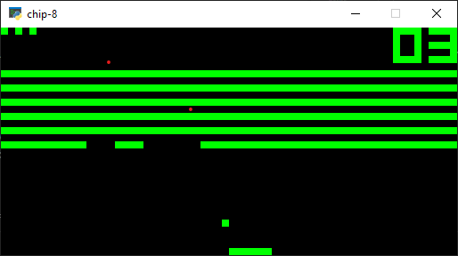

# CHIP-8

CHIP-8 emulator written in Python 3.10 with [Structural Pattern Matching](https://www.python.org/dev/peps/pep-0636/). Uses [PySDL2](https://pypi.org/project/PySDL2/) for graphics and input.



## Requirements
* Python 3.10
* [Poetry](https://python-poetry.org/)

## Usage

```shell
# install packages
$ poetry install

# run rom (.ch8)
$ poetry run python ./chip_8_py/main.py path_to_rom
```

## TODO

* Clean up project structure and code
* Add audio
* Fix framerate
* Use a formatter ([black is broken for Python 3.10 for the moment](https://github.com/psf/black/issues/2242))
* Add debugger